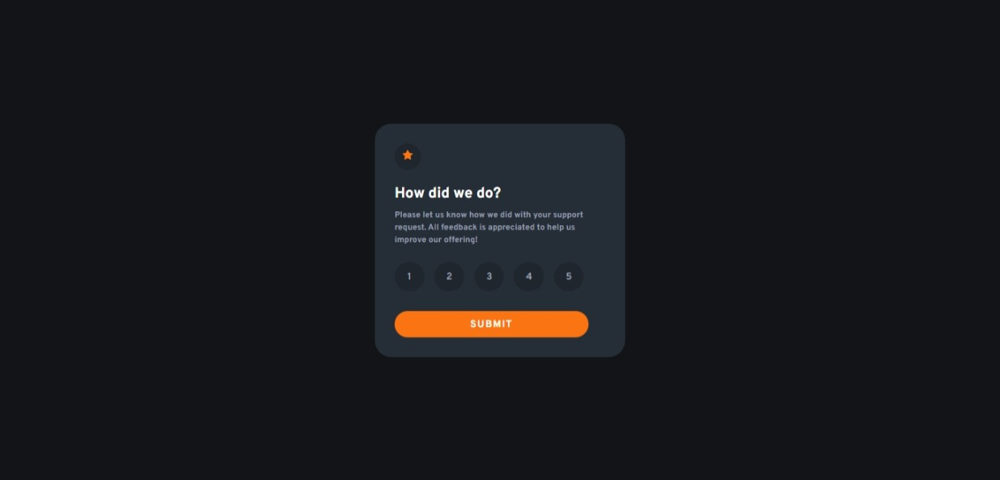

# Frontend Mentor - Interactive rating component solution

This is my solution to the [Interactive rating component challenge on Frontend Mentor](https://www.frontendmentor.io/challenges/interactive-rating-component-koxpeBUmI). Frontend Mentor challenges help you improve your coding skills by building realistic projects. 

## Table of contents

- [Overview](#overview)
  - [The challenge](#the-challenge)
  - [Screenshot](#screenshot)
  - [Links](#links)
- [My process](#my-process)
  - [Built with](#built-with)
  - [What I learned](#what-i-learned)
  - [Continued development](#continued-development)
- [Author](#author)
- [Acknowledgments](#acknowledgments)

## Overview

### The challenge

Users should be able to:

- View the optimal layout for the app depending on their device's screen size
- See hover states for all interactive elements on the page
- Select and submit a number rating
- See the "Thank you" card state after submitting a rating

### Screenshot

### Links

- Solution: [Preview Code](https://github.com/SoulOfMo/rating-component)
- Live Site: [Live Site](https://soulofmo.github.io/rating-component/)

## My process

### Built with

- Semantic HTML5 markup
- CSS custom properties
- Flexbox

### What I learned
As basic as the project seem, I had a lot of problem implementing the js(I was just learning javascript). After a lot of pratices, I was able complete the challenge and my understanding of JS is getting better.

### Continued development

- I would continue with my learning of js and work on more junior level project on [Frontend Mentor](https://www.frontendmentor.io/)

# Author
- Frontend Mentor - [@SoulOfMo](https://www.frontendmentor.io/profile/SoulOfmo)
- Twitter - [@morin_sultan](https://www.twitter.com/morin_sultan?s=09)

## Acknowledgments